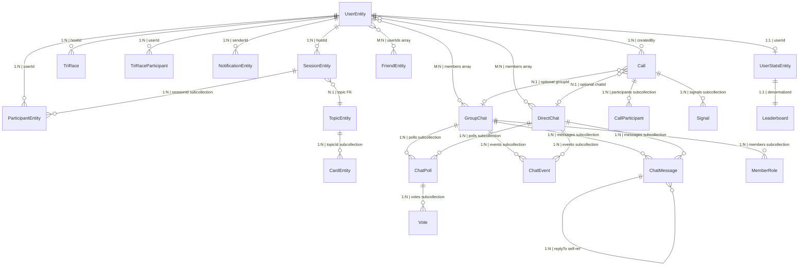
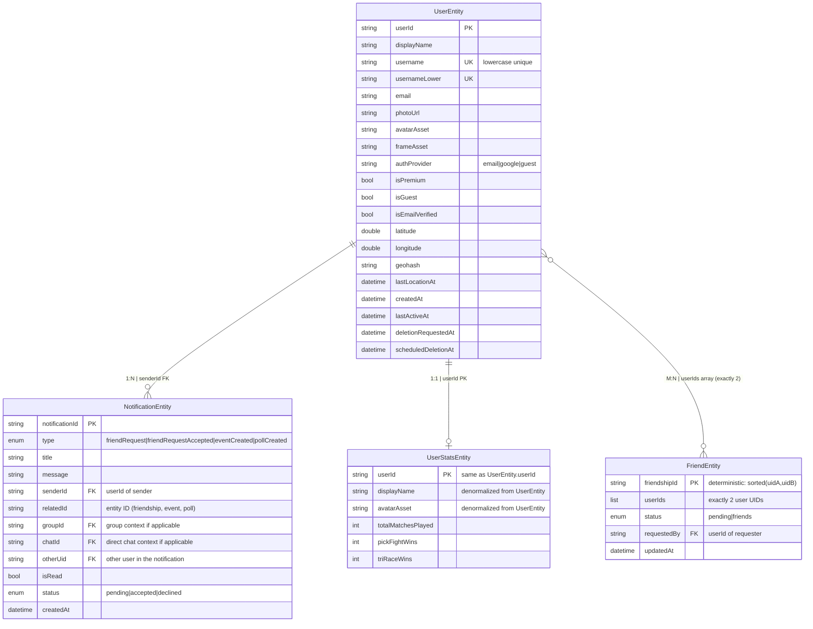
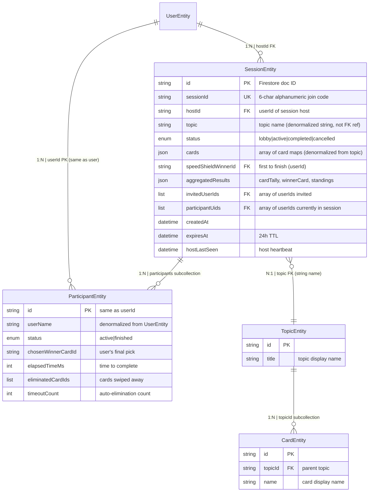
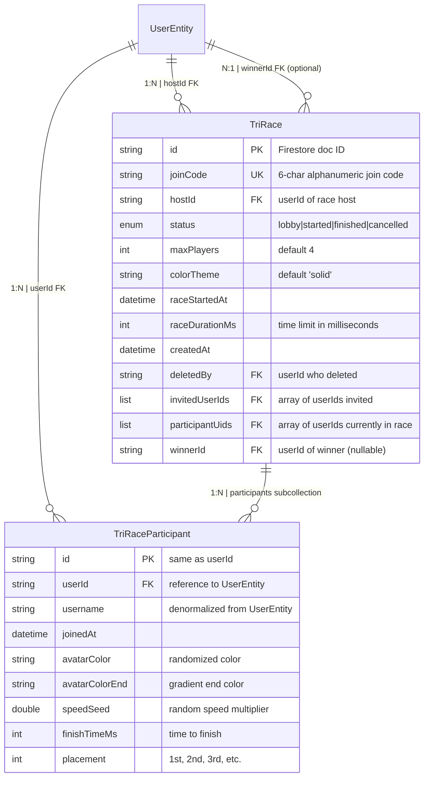
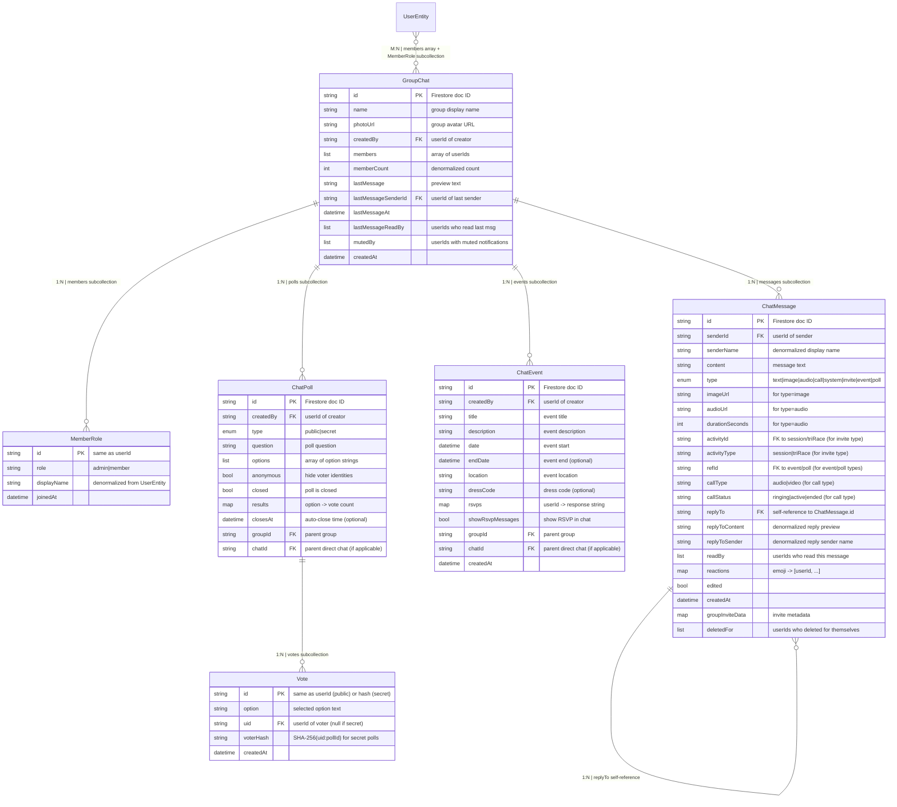
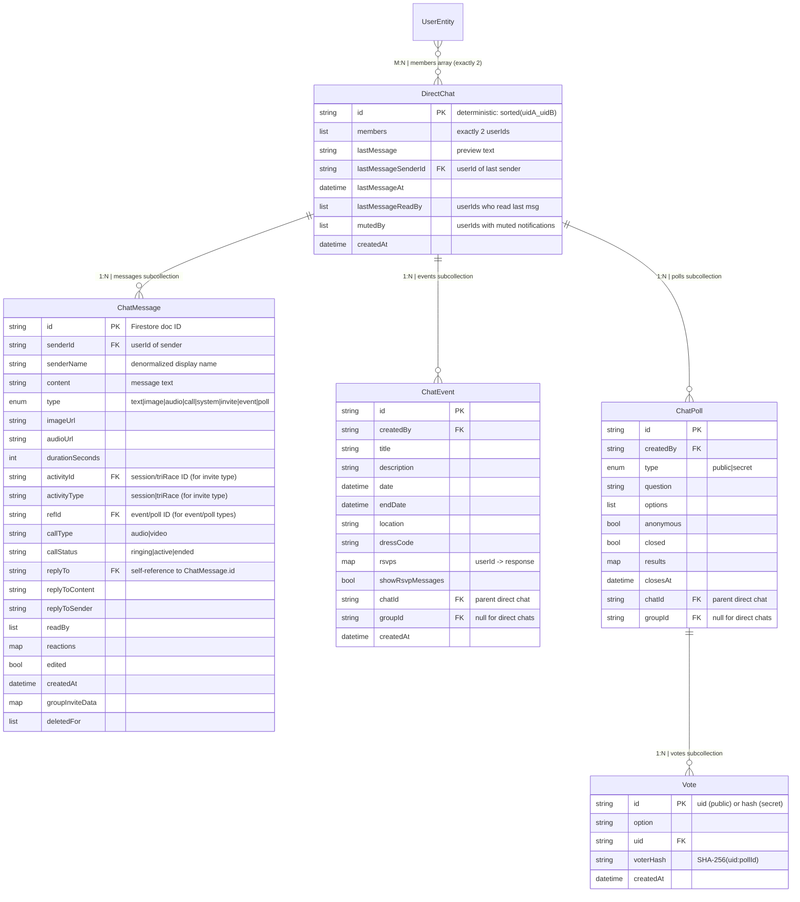
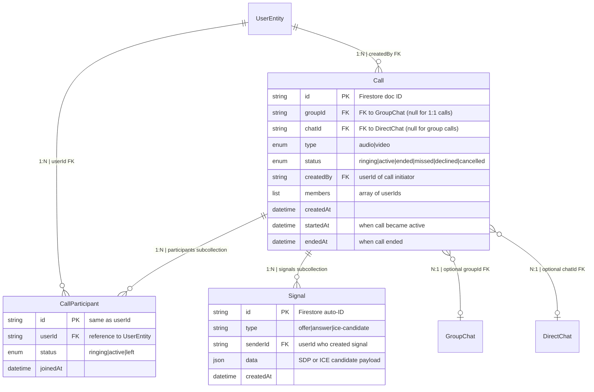
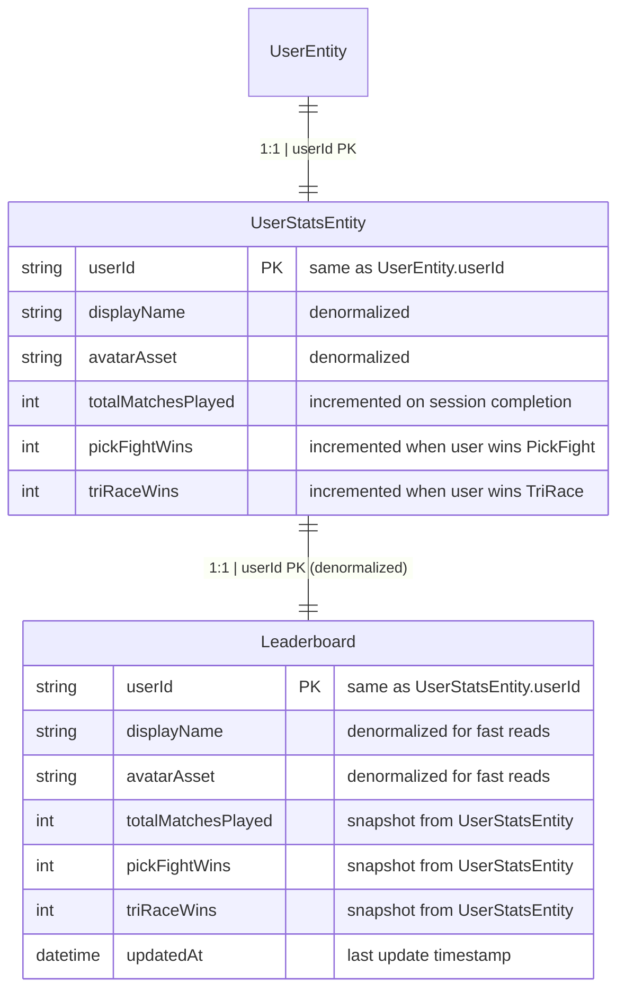

# WeDo — Entity Relationship Diagrams (Detailed)

> **Notation Legend**
> - `||` = mandatory one
> - `o|` = optional one
> - `|{` = mandatory many
> - `o{` = optional many
> - Each relationship line: **cardinality | FK field | constraint**

---

## 1. Overview — All Entities

---

## 2. User & Identity

**Relationship Notes:**
- `FriendEntity.userIds` is a **deterministic ID**: `sorted([uidA, uidB]).join('_')` — guarantees one friendship doc per pair
- `FriendEntity.requestedBy` references the user who sent the request
- `NotificationEntity` is a **subcollection** under `users/{userId}/notifications/`
- `NotificationEntity.relatedId` polymorphically points to different entity types depending on `type`
- `UserStatsEntity` is at Firestore path `userStats/{userId}` (separate from `users/{uid}`)

---

## 3. Session (PickFight) & Gameplay

**Relationship Notes:**
- `SessionEntity.topic` is a **string name** (not a Firestore FK reference) — denormalized for display
- `SessionEntity.cards` are **denormalized** from `TopicEntity` → `CardEntity` at session creation time
- `ParticipantEntity` lives in a **subcollection**: `sessions/{sessionId}/participants/{userId}`
- `SessionEntity.participantUids` is a **denormalized array** for `arrayContains` queries
- `SessionEntity.aggregatedResults` is written by `SessionService.aggregateResults()` and contains:
  - `cardTally`: map of card → count
  - `winnerCard`: the card with highest votes
  - `speedShieldWinnerId`: userId of first to finish
  - `standings`: ordered list of participants
- `SessionService.aggregateResults()` calls `LeaderboardService.recordPickFightResult()` to update `UserStatsEntity`

---

## 4. TriRace

**Relationship Notes:**
- `TriRace` lives at Firestore path `triRaces/{raceId}`
- `TriRaceParticipant` lives in subcollection: `triRaces/{raceId}/participants/{userId}`
- `TriRaceParticipant.userId` is **always the same as** the document ID (`id`)
- `TriRace.winnerId` is set by `TriRaceService.markTriRaceFinished()` after race completion
- `TriRaceService.markTriRaceFinished()` calls `LeaderboardService.recordTriRaceResult()` to update `UserStatsEntity.triRaceWins`
- `TriRaceParticipant.speedSeed` is a random multiplier that determines race speed
- `TriRaceParticipant.placement` is determined by `finishTimeMs` (lowest wins)

---

## 5. Group Chat

**Relationship Notes:**
- `GroupChat` lives at Firestore path `groups/{groupId}`
- `ChatMessage`, `ChatEvent`, `ChatPoll` are all **subcollections** under the group
- `Vote` is a **nested subcollection**: `groups/{groupId}/polls/{pollId}/votes/`
- `ChatMessage.replyTo` is a **self-reference** for threaded replies
- `ChatMessage.activityId` polymorphically references:
  - `SessionEntity.sessionId` when `type = 'invite'` and `activityType = 'session'`
  - `TriRace.id` when `type = 'invite'` and `activityType = 'triRace'`
- `ChatMessage.refId` polymorphically references:
  - `ChatEvent.id` when `type = 'event'`
  - `ChatPoll.id` when `type = 'poll'`
- `Vote.id` is:
  - The user's `uid` for **public** polls
  - A `SHA-256(uid:pollId)` hash for **secret** polls (anonymous)
- `MemberRole` is at subcollection path `groups/{groupId}/members/{userId}`
- `GroupService.addMember()` atomically: adds to `members` array + creates `MemberRole` doc + increments `memberCount`

---

## 6. Direct Chat

**Relationship Notes:**
- `DirectChat` lives at Firestore path `directChats/{chatId}`
- **Deterministic ID**: `chatId = sorted([uidA, uidB]).join('_')` — guarantees one chat per user pair
- `DirectChat.members` always contains **exactly 2** user IDs
- Subcollection structure mirrors Group Chat: `messages/`, `events/`, `polls/`, `polls/{pollId}/votes/`
- `ChatMessage`, `ChatEvent`, `ChatPoll` schemas are **shared** between Group and Direct chats
- The `groupId` field on `ChatEvent`/`ChatPoll` is `null` for direct chats, populated for group chats
- `DirectService.getOrCreateChat()` uses the deterministic ID to prevent duplicate chats

---

## 7. Calls & WebRTC

**Relationship Notes:**
- `Call` lives at Firestore path `calls/{callId}`
- `Call` references **either** `GroupChat` (via `groupId`) **or** `DirectChat` (via `chatId`) — never both
- `CallParticipant` lives in subcollection: `calls/{callId}/participants/{userId}`
- `Signal` lives in subcollection: `calls/{callId}/signals/`
- `Signal` is **ephemeral** — `CallService.cleanupCallData()` batch-deletes all signals and participants when call ends
- `WebRTCService` manages peer connections; `CallService` handles Firestore signaling
- `CallManager` orchestrates the lifecycle and routes call messages to the appropriate chat via `DirectService.sendCallMessage()` or `GroupService.sendCallMessage()`

---

## 8. Leaderboard & Stats

**Relationship Notes:**
- `UserStatsEntity` lives at Firestore path `userStats/{userId}` (source of truth)
- `Leaderboard` lives at Firestore path `leaderboards/{userId}` (denormalized snapshot)
- `LeaderboardService.ensureUserStats()` creates both documents atomically on first write
- `LeaderboardService.recordPickFightResult()`:
  1. Increments `totalMatchesPlayed` for all participants
  2. Increments `pickFightWins` for the winner
  3. Backfills `Leaderboard` doc for immediate visibility
- `LeaderboardService.recordTriRaceResult()`: same pattern for tri-race stats
- `Leaderboard` is denormalized so ranking queries don't need to aggregate `UserStatsEntity` docs

---

## Cross-Entity Reference Summary

| Source Entity | Field | Target Entity | Reference Type |
|---------------|-------|---------------|----------------|
| `SessionEntity` | `hostId` | `UserEntity` | FK (userId) |
| `SessionEntity` | `participantUids[]` | `UserEntity` | Denormalized array |
| `SessionEntity` | `invitedUserIds[]` | `UserEntity` | Denormalized array |
| `SessionEntity` | `speedShieldWinnerId` | `UserEntity` | FK (userId) |
| `ParticipantEntity` | `id` | `UserEntity` | Same as userId |
| `ParticipantEntity` | `chosenWinnerCardId` | `CardEntity` | FK (card ID) |
| `TriRace` | `hostId` | `UserEntity` | FK (userId) |
| `TriRace` | `winnerId` | `UserEntity` | FK (userId) |
| `TriRaceParticipant` | `userId` | `UserEntity` | FK (userId) |
| `FriendEntity` | `userIds[]` | `UserEntity` | Array of 2 userIds |
| `FriendEntity` | `requestedBy` | `UserEntity` | FK (userId) |
| `NotificationEntity` | `senderId` | `UserEntity` | FK (userId) |
| `NotificationEntity` | `relatedId` | Polymorphic | Friendship/Event/Poll ID |
| `NotificationEntity` | `groupId` | `GroupChat` | FK (groupId) |
| `NotificationEntity` | `chatId` | `DirectChat` | FK (chatId) |
| `GroupChat` | `createdBy` | `UserEntity` | FK (userId) |
| `GroupChat` | `members[]` | `UserEntity` | Denormalized array |
| `ChatMessage` | `senderId` | `UserEntity` | FK (userId) |
| `ChatMessage` | `replyTo` | `ChatMessage` | Self-reference (message ID) |
| `ChatMessage` | `activityId` | `SessionEntity` or `TriRace` | Polymorphic FK |
| `ChatMessage` | `refId` | `ChatEvent` or `ChatPoll` | Polymorphic FK |
| `ChatEvent` | `createdBy` | `UserEntity` | FK (userId) |
| `ChatEvent` | `groupId` | `GroupChat` | FK (groupId, nullable) |
| `ChatEvent` | `chatId` | `DirectChat` | FK (chatId, nullable) |
| `ChatPoll` | `createdBy` | `UserEntity` | FK (userId) |
| `ChatPoll` | `groupId` | `GroupChat` | FK (groupId, nullable) |
| `ChatPoll` | `chatId` | `DirectChat` | FK (chatId, nullable) |
| `Vote` | `uid` | `UserEntity` | FK (userId, null for secret) |
| `Call` | `createdBy` | `UserEntity` | FK (userId) |
| `Call` | `groupId` | `GroupChat` | FK (nullable) |
| `Call` | `chatId` | `DirectChat` | FK (nullable) |
| `CallParticipant` | `userId` | `UserEntity` | FK (userId) |
| `Signal` | `senderId` | `UserEntity` | FK (userId) |
| `UserStatsEntity` | `userId` | `UserEntity` | FK (userId) |
| `Leaderboard` | `userId` | `UserEntity` | FK (userId) |
